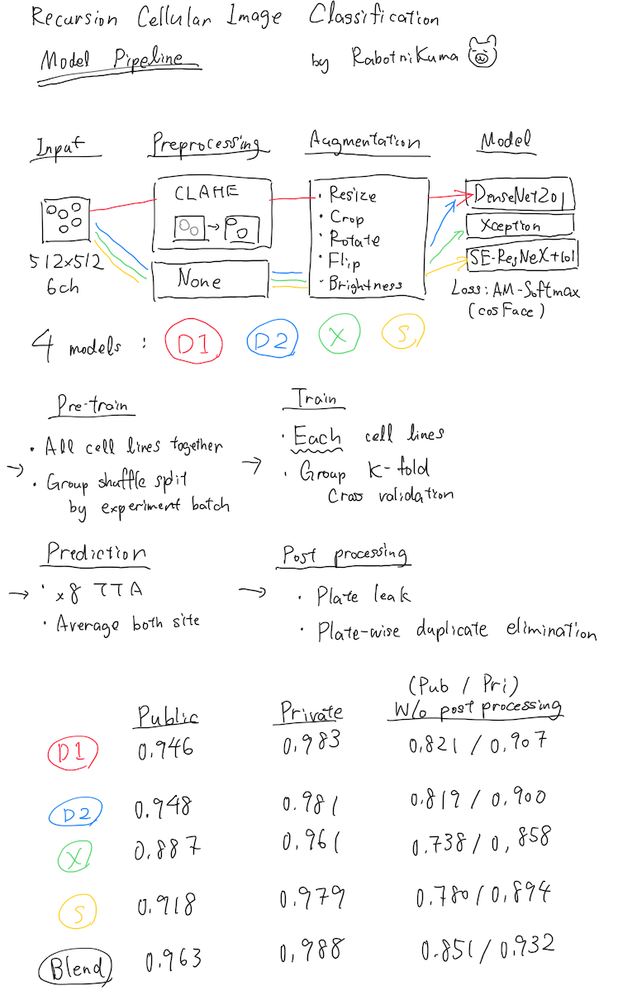

# Kaggle: Recursion Cellular Classification (WIP)

## メンバー

- [Hiroshi Yoshihara](https://github.com/analokmaus)\*
- [Taiki Yamaguchi](https://github.com/yamaguchitai)
- [Kosaku Ohno](https://github.com/Kevinrobot34)

\*この記事を書いた熊

## 結果

Public :  0.96343 (17位)

Private : 0.98871 (16位)

- [ソースコード](https://github.com/analokmaus/kaggle-recursion)
- [解説ディスカッション](https://www.kaggle.com/c/recursion-cellular-image-classification/discussion/110361)

## 概要

[コンペ公式ページ](https://www.kaggle.com/c/recursion-cellular-image-classification/overview)

- 細胞の画像分類タスク
  - 厳密には細胞のフェノタイプから介入(siRNA)を当てるタスク
- 1108種類の分類
- 入力は強調部位を変えた512x512/6チャネルの画像
- 評価指標はmulti class accuracy

## 我々のアプローチ



### データの理解

今回の題材となった実験の構造はなかなか複雑であり、また
**高いスコアのためには避けては通れない部分** であった。

```
細胞株(HEPG2, HUVEC, RPE, U2OS)
┣ 実験バッチ(HEPG2-01) - 各細胞株について複数回実験が行われた。
  ┣ plate(1-4)        - wellが384個ある実験用プレート。外周は使わない。
    ┣ well(1-277)     - 細胞とsiRNAが入る穴。ここが実験の最小単位。
      ┣ experimental  - 今回の分類対象のsiRNAが入っている。
      ┣ + control     - すでに反応がわかっているsiRNAを入っている。実験が進んでいるかの確認のため。
      ┣ - control     - siRNAが入っていない。ベースライン。
        ┣ site1       - 1つのwell内の2箇所で撮影される。ここが各画像に対応する
        ┣ site2
    ...
  ...
...
```

ここから

- 細胞株 * siRNA = 4 * 1108 通りの反応が発生している
  - モデルは細胞株ごとに4つに分けた方が精度が高い
- 2つのsiteで撮影された画像は別々に扱い、平均値をwellの予測値として使用する
- controlたちをどう使うかがポイント

といったことが示唆された。

### 前処理

ディスカッションから実験バッチ間の差異が報告されていたので、
`Contrast Limited Adaptive Histogram Equalization (CLAHE)`
を使用した。この手法は画像の明るさの偏りを補正する物で、
実験バッチ内外の画像を均一化することを期待した。

その結果学習が早くなり、スコアにもわずかな改善が見られた。

### モデル

画像同士の類似性から、本コンペの初期から深層距離学習(cosFace)を使用した。

バックボーンとして以下のものを試した。その際に、6チャネルの入力を受け付けるように最初の畳み込み層を改変した。

- DenseNet201
- EfficientNet
- Xception
- ResNet101-cbam
- SE-ResneXt101

が、いくつかのモデルでは著しく過学習する傾向があった。

訓練そのものは全細胞株の画像を使った予備学習と細胞株別行った本学習の2段階に分けて行った。
いずれの学習においても同じ実験バッチの画像がtrainとvalidに混在しないように実験バッチに対してgroup k foldで分けた。

また、予測時にTest time augmentation(TTA)を1枚の画像につき8回行った。

### リーク

予測対象のsiRNAの各プレートへの割り振りの規則性に関するリークが発見された。
このことはディスカッションで報告され、運営も直ちに対処した。

その結果、testデータに含まれる一つの実験バッチがリークによって完全に予測可能になったため評価から除外され、参加者は合法的にtrainデータを増やすことができた。

さらに、今回は各実験バッチで1108個のラベルがそれぞれ一回のみ登場することがわかっていたので、
ハンガリー法を用いた割り当て問題として重複なく予測をすることも重要なポイントであった。

### その他

通常、評価時には`model.eval()`を適用する。(PyTorch)

evalモード時は、dropoutとbatch normalizationに使用する統計量がそれまでの全体平均になる。
そうでない時は統計量がバッチ内のものになる。

今回のデータにおいては実験バッチ間の差異を打ち消すためにevalモードを敢えて適用しないことでスコアが改善した。

データ特性によってevalモードにするかを判断するというのは初めてのことで、勉強になった。

### うまくいかなったこと

元々生物実験に携わっていた者としてcontrolの画像の意味は理解しているつもりだったので、
以下のtwoheadモデルも試した。

```
Experimental image --->| Backbone |---+
                                      |
                                      (-)--->| metric learning |
                                      |
Neg control image  --->| Backbone |---+
```

が、学習が進みにくくスコアも悪化した。

実際には、
いくつかの上位チームはcontrol画像も拡張データとして使用し1139クラス分類の学習を行っていた。

## 他の上位チームが使用したアプローチ

- 擬似ラベル
- 超解像技術を使ったupconvert
- control画像を拡張データとして使用し1139クラス分類
- Domain Adaptation
- Mean teacherを使用した半教師あり学習

などの手法が上位チームで使用されていた。
いくつかは我々のチームでも考案されたが時間不足で試すことを諦めたもので、
悔しさが残る結果になった。

## Recursion Pharma へのインタビュー

コンペから終わって、LinkedInにRecursionのMLチームの幹部から直々に善戦を称え
リクルートのお誘いが来たので、電話にて1時間ほどお話をした。

自分はそれまではRecursionについてはAIを使ってるなんだかイケてる
メリケンのバイオベンチャーくらいの認識だったが、折角の機会だったのでRecursion社についても色々聞いた。

多くは社のウェブサイトにも乗っている情報だがまとまっている日本語記事が少ないので、
自分なりにわかったことをまとめる。

### やっていること

彼らは`phenotypic screening`と呼ばれる手法で高効率でバイオ医薬品のスクリーニングを行っている。

それは、

1. 正常な細胞と疾患モデル細胞をdeep learningを使ってテンソルで表現し(fingerprintsならぬ`Phenoprints™`)
2. 高度に自動化された設備で評価対象化合物を細胞に加え
3. その効果を細胞の変化=`Phenoprints™`で評価する

という流れを指すようだ。
この`phenotypic screening`で疾患モデル細胞を正常細胞に近づけることができる化合物を探す、とのこと。

恐ろしいのはその効率で、**毎週あたり数百万枚単位の画像が集まる** らしい。

### パイプライン

*※製薬業界におけるパイプラインとは(非)臨床試験が進行中の新薬候補を指します。基本的には多ければ多いほど強いです。*

パイプラインもなかなか多く、フェーズ1の物が2つ、前臨床が10個ほど、候補化合物を入れると数10個になる。
このパイプラインの多さは高度に自動化されたスクリーニングシステムがあってこそのものだろう。

### その他

我が国の製薬最大手の武田薬品とも共同研究をしているらしい。**意外。**
